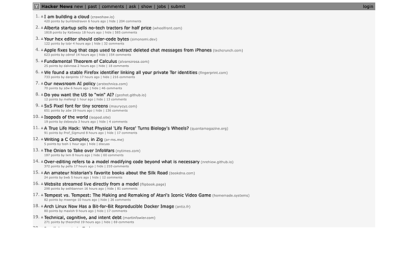
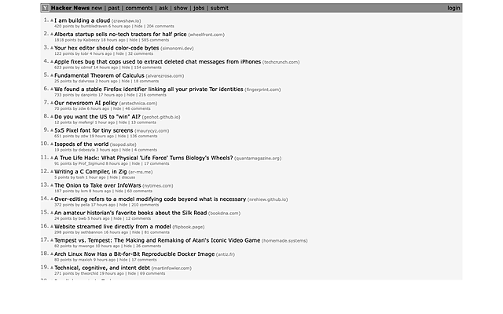
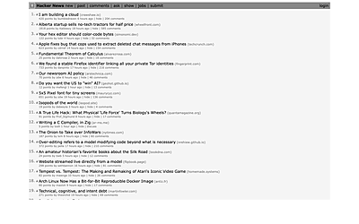
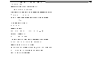

# tinyscreenshot

> **Token-frugal screenshots for AI agents.**
> Hand Claude / GPT / Gemini a screenshot that costs ~540 tokens instead of ~2100, without losing a single word of information.

<p align="center">
  <a href="https://github.com/franzenzenhofer/tinyscreenshot/actions/workflows/ci.yml"></a>
  <a href="https://pypi.org/project/tinyscreenshot/"></a>
  <a href="https://pypi.org/project/tinyscreenshot/"></a>
  <a href="LICENSE"></a>
</p>

---

## The problem

Every screenshot you hand to an LLM burns tokens. Anthropic meters vision at roughly

> **`tokens ≈ (width × height) / 750`**

A raw retina screenshot hits the 1.6-megapixel server-side cap and costs **~2100 tokens**. Multiply by dozens of captures in an agent session and you're paying real money to make the model squint at pixels it didn't need.

The fix is obvious once you see it: **downsize before you send.** The hard part is doing it fast, cross-platform, with the right defaults, and without losing the text you actually wanted the model to read.

That's `tinyscreenshot`.

## The same screen, four token budgets

Each of these is a processed capture of the *exact same* Hacker News front page. Claude reads all four — but the last one costs 16× fewer tokens than the first.

| 800 px · grey · **~533 t** | 640 px · grey · **~341 t** | 400 px · grey · **~133 t** | 200 px · mono · **~33 t** |
|---|---|---|---|
|  |  |  |  |
| **Full legibility.** Every headline readable, every byline, every domain, every point count. Recommended default. | **Still fully readable.** Best sweet spot if you want the tiniest capture that still reads prose. | **Prose survives.** Headlines and bylines still readable; small chrome starts to blur. Great for "did the story appear?" checks. | **Presence only.** You can tell it's a list of items; no text. Perfect for "is the page still loading?" yes/no. |

> At every size, **color mode does not affect token cost** — only pixel count does. `grey` costs the same as `color` but stays crisper after resize.

## 30-second install

```bash
# isolated (recommended)
pipx install tinyscreenshot

# or:
pip install --user tinyscreenshot

# or one-line curl:
curl -fsSL https://raw.githubusercontent.com/franzenzenhofer/tinyscreenshot/main/scripts/install.sh | bash
```

Then, if you use Claude Code, wire up the bundled skill so Claude reaches for this tool automatically:

```bash
tinyscreenshot install-skill --force
```

## 30-second use

```bash
$ tinyscreenshot main
captured: /tmp/tiny-shots/20260423-101802-main.png
  source: 1512x982  (main display)
  output: 800x520  grey +sharpen  [png]
  tokens: ~554 (saved ~1425t vs full source)
  size:   80.7 KB
/tmp/tiny-shots/20260423-101802-main.png
```

stdout: the path. stderr: a human-readable report. Pipe the path into your next step.

```bash
# capture and open in the default viewer
open "$(tinyscreenshot main)"

# capture a single app, 1-bit mono for a crisp terminal shot
tinyscreenshot app Ghostty -w 640 -c mono

# pixel-exact rectangle
tinyscreenshot region 0,0,1200,800 -w 400

# let me draw a selection
tinyscreenshot interactive
```

## What it captures

| Mode | What you get |
|---|---|
| `tinyscreenshot main` | Primary display |
| `tinyscreenshot all` | Every display stitched into one image |
| `tinyscreenshot display 2` | A specific display (run `tinyscreenshot list` to see the indexes) |
| `tinyscreenshot window` | Click-to-select window |
| `tinyscreenshot app "Google Chrome"` | The frontmost window of a named app — native resolution, no search |
| `tinyscreenshot region 0,0,1200,800` | A pixel-exact rectangle in screen coordinates |
| `tinyscreenshot interactive` | Draw your own selection |
| `tinyscreenshot list` | Print display indexes, sizes, and full-res token cost |

## The defaults are opinionated on purpose

- **Width: 800 px.** Chosen to land at ~540 tokens — the lowest number at which arbitrary modern UIs (news sites, VS Code, Figma, Chrome DevTools) still read cleanly. Use `-w 640` for compact, `-w 1280` for code-dense inspection.
- **Color: `grey`.** Identical token cost to `color`, but no chroma fringing on thin text after Lanczos downscale. Use `-c color` only when hue matters.
- **Sharpen: on** (auto for grey/mono, off for color). A light unsharp mask recovers the edge contrast lost during resize. It's the difference between "I can read this" and "I can read this easily."
- **Output: `/tmp/tiny-shots/<timestamp>-<slug>.png`.** Predictable, scriptable, disposable.

All overridable, none required.

## How much does it really save?

Real example: one agent session that took eight screenshots of a web app during a debugging loop.

| Approach | Tokens per shot | Per session (8) | Per 1000 sessions |
|---|---:|---:|---:|
| Raw retina capture | ~2100 | 16 800 | 16.8 M |
| `tinyscreenshot main -w 1280` | ~1365 | 10 920 | 10.9 M |
| `tinyscreenshot main` (default) | ~540 | 4 320 | 4.3 M |
| `tinyscreenshot main -w 400` | ~138 | 1 104 | 1.1 M |

At $15/M input tokens for Claude Sonnet, the default setting saves you **~$190** per 1000 sessions vs raw retina captures — for free, with identical information.

## Decision matrix (for humans and agents)

| Task | Recommended flags | Why |
|---|---|---|
| "What's on my screen?" | `main -w 800 -c grey` | Default, reads everything |
| "Is the progress bar still spinning?" | `main -w 400 -c grey` | Presence check — 4× cheaper |
| "Read the code in my editor" | `main -w 1280 -c grey` | Dense text, still 35% off retina |
| "Show Claude this specific app" | `app <Name> -w 800` | Native-pixel window capture, ignores other windows |
| "The left monitor" | `display <N> -w 800` | Pick a specific physical display |
| "Just this panel" | `region x,y,w,h -w 800` | Pixel rectangle |
| "Terminal-only output" | `... -w 640 -c mono` | 1-bit dither is crisper on bitmap glyphs |

## Platform support

| Platform | Status | Notes |
|---|---|---|
| macOS (Apple Silicon + Intel) | ✅ every mode | Grant Screen Recording to your terminal the first time |
| Linux X11 | ✅ every mode | Install `maim` + `xdotool` (or `scrot` as fallback) |
| Linux Wayland | ✅ every mode | Install `grim` + `slurp` |
| Windows | 🚧 planned v0.2 | |

## Under the hood

- [`mss`](https://python-mss.readthedocs.io) for fast, dependency-free screen capture on every platform.
- [`Pillow`](https://pillow.readthedocs.io) for resize, colorspace conversion, and unsharp-mask — **no ImageMagick dependency.**
- macOS `screencapture` / Linux `maim` · `scrot` · `grim` for window and single-app capture (native window IDs).
- A ~100-line token-cost model implementing Anthropic's public pricing formula.
- Zero network I/O. Screenshots live on your disk, nowhere else.

## FAQ

**Does color mode change token cost?** No. The Anthropic vision model rasterizes your image before metering — it only sees pixels. `grey` and `color` at the same resolution cost the same number of tokens. `grey` is picked as the default because it stays sharper at small sizes.

**Does file format change token cost?** No. PNG / JPEG / WebP all rasterize to pixels. Format only matters for your own disk space and upload bandwidth.

**What's the maximum useful resolution?** Anthropic caps images at 1.6 MP server-side, so capturing retina@2x is money down the drain. `tinyscreenshot` never exceeds your requested width and never upscales.

**Why isn't `color` the default for pretty screenshots?** Because you're sending the image to a language model, not to a human. The model sees pixels regardless of mode, and greyscale downsamples cleaner. If you want a screenshot to paste into a slide deck, pass `-c color`.

**Can I use it from Python directly?** Yes:
```python
from tinyscreenshot.capture import capture_main
from tinyscreenshot.process import ProcessOptions, process
img = process(capture_main().image, ProcessOptions(width=800, color="grey"))
img.save("out.png")
```

## Development

```bash
git clone https://github.com/franzenzenhofer/tinyscreenshot && cd tinyscreenshot
python -m venv .venv && source .venv/bin/activate
pip install -e '.[dev]'

pytest                          # 28 tests, unit + CLI
ruff check src tests            # lint
python experiments/run_matrix.py --capture   # Pareto experiment
```

## Credits & licence

MIT. Built by Franz Enzenhofer as a weekend-scale "why is every screenshot wasting tokens?" problem. Contributions welcome — especially Windows support.
